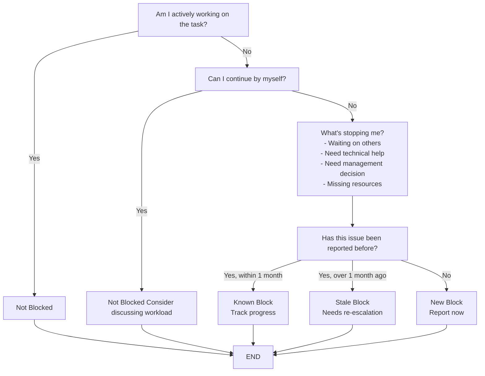

```mermaid
flowchart TD
    A1[Am I actively working on the task?] -->|Yes| B1[Not Blocked]
    A1 -->|No| A2[Can I continue by myself?]
    A2 -->|Yes| B2[Not Blocked Consider discussing workload]
    A2 -->|No| A3[What's stopping me?\n- Waiting on others\n- Need technical help\n- Need management decision\n- Missing resources]

    A3 --> A4[Has this issue been reported before?]
    A4 -->|Yes, within 1 month| B3[Known Block\nTrack progress]
    A4 -->|Yes, over 1 month ago| B4[Stale Block\nNeeds re-escalation]
    A4 -->|No| B5[New Block\nReport now]

    B1 --> END
    B2 --> END
    B3 --> END
    B4 --> END
    B5 --> END
```
